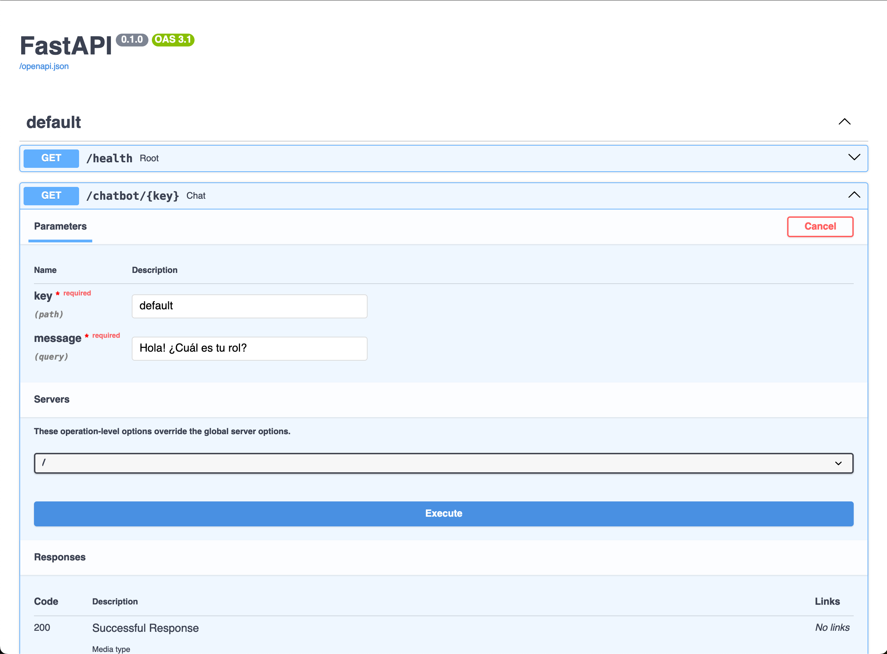
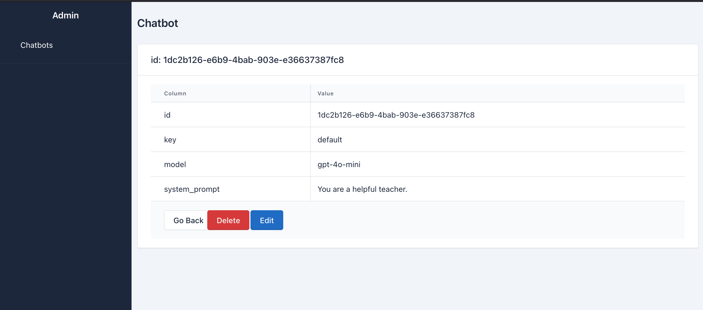

# Project Template Overview

This repository provides a template to kickstart your project using the following tech stack:

- **Python**: Leverage the most extensive library ecosystem for developing machine learning and deep learning applications.

- **[FastAPI](https://fastapi.tiangolo.com)**: A modern, fast, and lightweight framework for building APIs with Python.

- **[SQLModel](https://sqlmodel.tiangolo.com)**: An ORM that combines the best features of SQLAlchemy and Pydantic, allowing for seamless database management and built-in data validations.

- **[SQLAlchemy Admin](https://github.com/aminalaee/sqladmin)**: Powered by Tablier, this is the simplest and most recommended way to set up an admin panel for your FastAPI-based API.

## Getting Started

To run the project locally, follow these steps:

1. Install the required dependencies:
   ```bash
   pip install -r requirements.txt
   ```

2. Start the FastAPI development server:
   ```bash
   fastapi dev src/main.py
   ```

   or just run the application from python:

   ```bash
   python -m src.main
   ```
   
3. Open your browser and navigate to http://localhost:8000/docs to access the Swagger UI and interact with the API.



## Access the admin interface

To access the admin interface, navigate to http://localhost:8000/admin.



## Stream a LLM model with FastAPI

1. Put your openai key in the `.env` file.

```
OPENAI_API_KEY=your_openai_key
```

2. Access the default chatbot model by navigating to http://localhost:8000/chatbot/default?message=your_message.


## Project Structure

- `src/models`: Define your data models here.
- `src/repositories`: Implement the data access layer in this directory.
- `src/services`: Implement the business logic layer in this directory.
- `src/routers`: Define your API routes in this directory.'
- `src/admin`: Configure SQLAlchemy Admin in this directory.
- `src/utils`: Place global utility functions and helpers here.
